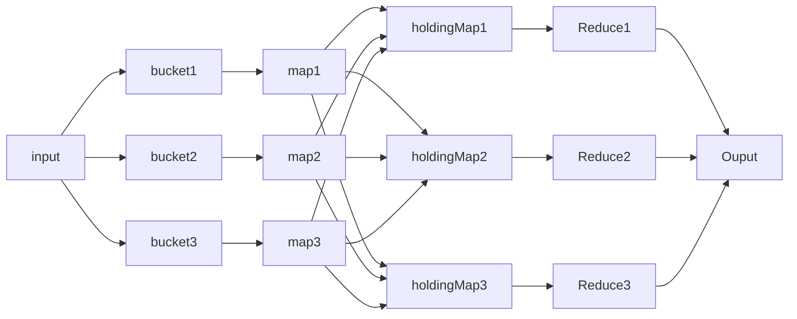
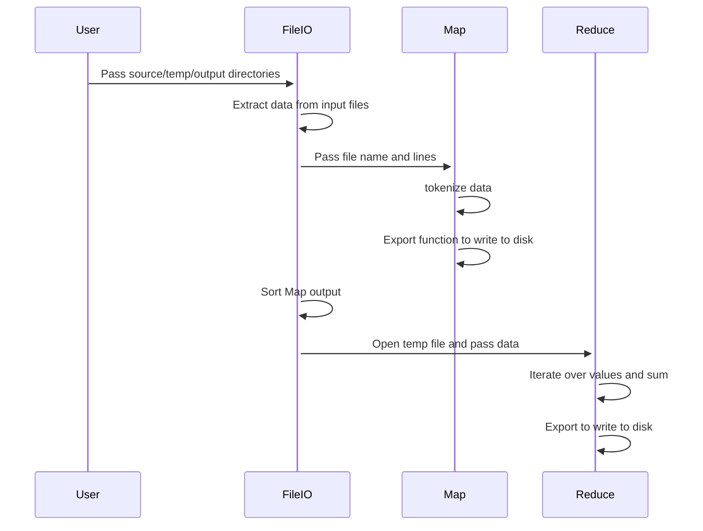
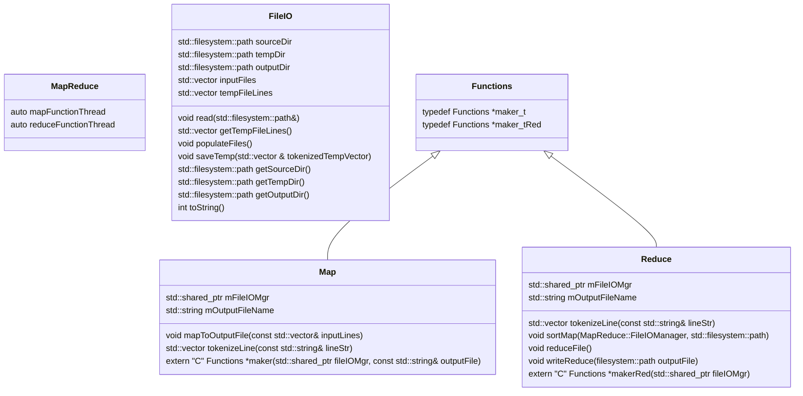

# OOD MapReduce Phase 3

# Background

MapReduce Phase 3, takes files provide as input and calls and concurrently splits them into smaller chunks. This phase builds on the previous iterations development and begins to incorporate concurrency into both Map and Reduce functions.

# Architecture

Initially data is taken into the program and split amongst n buckets, these files are then passed to a mapper function. This mapper function is a .so file that is called by the executive. The output from the mapper function is then stored in a corresponding holdingMap file.
Once the map function has been completed the temp output is passed to the reduce function, for aggregating keys, and finally the output is saved to file.

# Design

## Class Diagram

In order to implement the above architecture, there are a number of classes implemented to deliver the required functionality:

- MapReduce - This is the executive that calls classes and controls the creation and destruction of Map and Reduce Threads
- FileIO - This class handles all File operations
- Functions - This is an abstract base class, for Map And Reduce
- Map - Shared library, that is a derived class of Functions
- Reduce - hared library, that is a derived class of Functions

What is key in Phase 3, is the inclusion of threads within the MapReduce executive. These allow concurrent calling of Map functions, and once complete the concurrency is continued through the creation of multiple threads to allow reduce to operate concurrently.  

