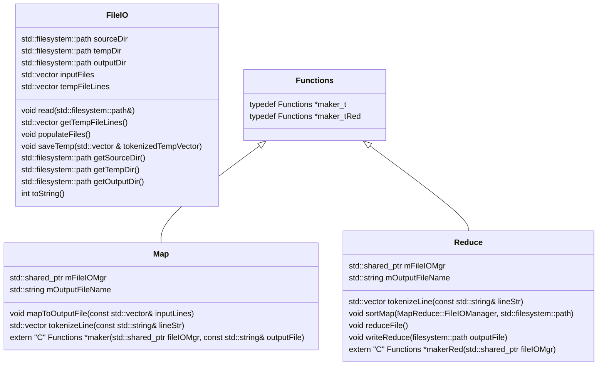
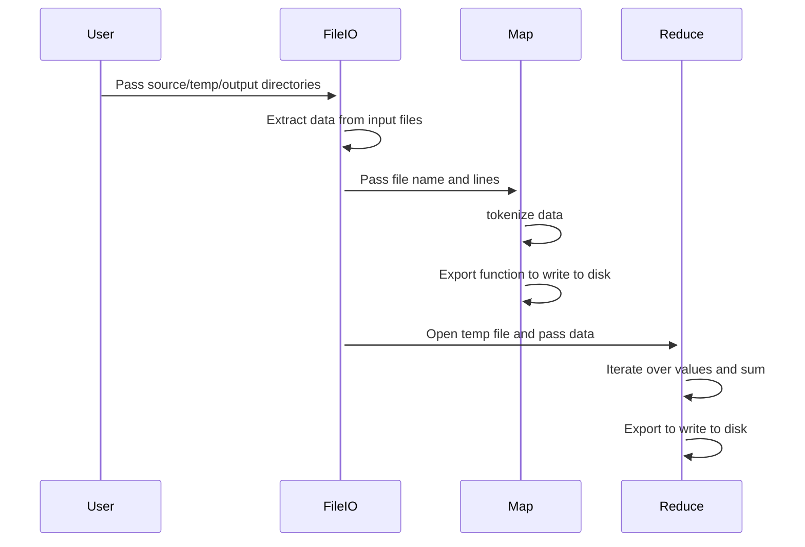

# CSE 687 Object Oriented Design Project
## MapReduce
## Phase #1

This file can evolve as classes and workflow are added

## Class Diagram

## MapReduce Flow

## Background
n Stage 2, you will be writing a standalone command-line program that is capable of running a user specified map and 
reduce function as specified in DLLs.
The program must run as a single process, no threads or processes (yet). The program shall take as input:
1. Directory where input files are stored
2. Directory for intermediary files (this can be defaulted, and a user provided one overrides the default).
3. Path for output file (this can be defaulted, and a user provided one overrides the default).
4. A path to the DLLs that specify the use-case specific:
a. map function
b. reduce function
DLLs will be loaded explicitly as details will not be known at compilation time!
## Methodology Requirements
1. You must work in a team of 2. If there is an odd number of students, there will be a single team of 3. No one
   will be allowed to work independently.
2.  You must use C++ in conjunction with MS Visual Studio and GitHub (student account).
3. You may use anything in the std library and additionally may use anything in the BOOST (https://www.boost.org/) library.
4. All changes must go through a code review by your partner(s).
5. All partners must submit a reasonably equal number of check-ins for each project, as evidenced by git submissions.
6. All partners must treat each other with respect.
## Technical Requirements
1. Mapper/Reducer should be generalized using some combination of templates, inheritance, and polymorphism.
2. Code formatting & comments should follow Google style guide: https://google.github.io/styleguide/cppguide.html
3. Errors, warnings, information, fatal errors, etc., will be logged.
Boost Logging can be used (https://www.boost.org/doc/libs/1_63_0/libs/log/doc/html/index.html).

## Rubric
1) Code behavioral correctness: 50%
   Along with above requirements, code must reasonably handle all error scenarios. Code must never crash or hang.
2) Presentation: 50%
   Includes demonstration of working code, discussion of roles, and overall Q&A.

