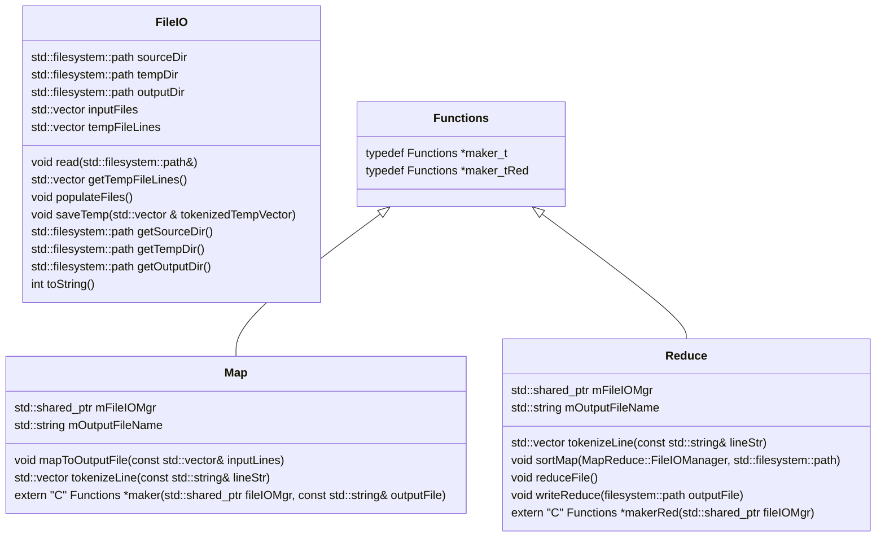
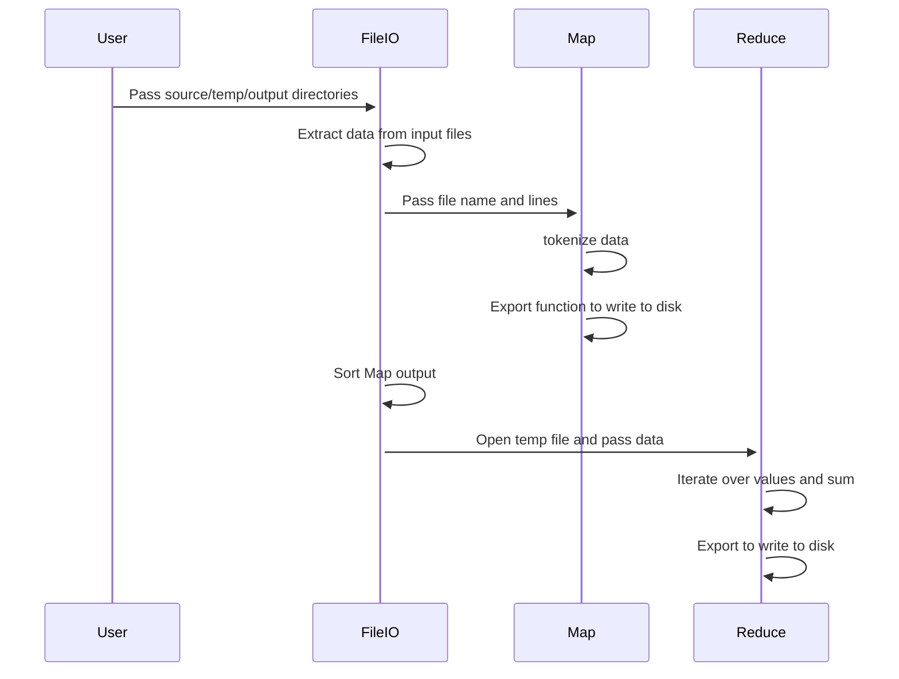

# CSE 687 Object Oriented Design Project
## MapReduce
## Phase #2

This file can evolve as classes and workflow are added

## Class Diagram

## MapReduce Flow

## Background
In Phase 3, you will be extending your Phase 2 solution:
1. Create multiple mapper and multiple reducer processes.
2. Create a partition function that splits keys into R buckets (where R is the number of reducer processes). 
   Each mapper will generate R output files corresponding to the number of reducers using the partition function.
3. The reducers can be created once all the mappers are complete.
4. The directories and file naming convention can be configurable.
5. Your command line executable (controller) will:
   - Assign the files in a reasonable way amongst the map processes.
   - Wait for all map processes to complete successfully.
   - Create reducer processes.
   - Wait for all reducer processes to complete successfully.
   - Write the SUCCESS file indicating a successful run.
6. Notice that the sorting and grouping should happen as part of the reducer process.
7. The mapper process and reducer process are separate entities from the DLLs.  
   The mapper process will need to run the mapper function from the DLL, same goes for the reducer.
8. You may either have a single executable that can do both mapper and reducer 
   OR you may choose to split these into separate executable projects. Either is fine.
9. No network communication is required for this project. The controller can get the exit codes 
   from the mappers & reducers to measure success.
## Methodology Requirements
1. You must work in a team of 2. If there is an odd number of students, there will be a single team of 3. No one
   will be allowed to work independently.
2.  You must use C++ in conjunction with MS Visual Studio and GitHub (student account).
3. You may use anything in the std library and additionally may use anything in the BOOST (https://www.boost.org/) library.
4. All changes must go through a code review by your partner(s).
5. All partners must submit a reasonably equal number of check-ins for each project, as evidenced by git submissions.
6. All partners must treat each other with respect.
## Technical Requirements
1. Errors, warnings, information, fatal errors, etc., will be logged.
Boost Logging can be used (https://www.boost.org/doc/libs/1_63_0/libs/log/doc/html/index.html).
## Documentation Requirements
### Architecture
The architecture of your project describes the various components that make up your project.  
These are not the actual classes and data, but more of a functional description.
The architecture of your project must include a system block diagram which shows each high-level component 
of your Map-Reduce system, along with any major sub-components.
The block diagram must also include interface definitions – connections between the high-level components, 
and connections between the major sub-components within a high-level component

### Design
The design of your project is intended to show how you broke down the architectural functionality into actual classes, 
including data.
You can describe your design in class diagrams (UML), pictures, text descriptions, or any combination of these.
You must indicate how the design relates to the architecture – which classes implement which component(s), 
and what data are flowing through each interface.
## Rubric
1) Code behavioral correctness: 50%
   Along with above requirements, code must reasonably handle all error scenarios. Code must never crash or hang.
2) Presentation: 30%
3) Program Documentation: 20%

