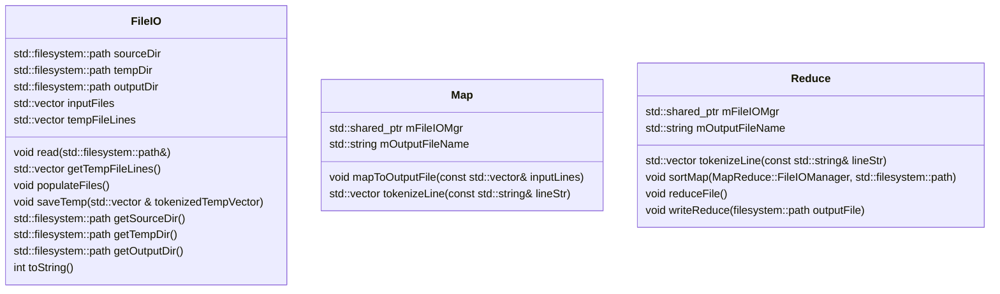
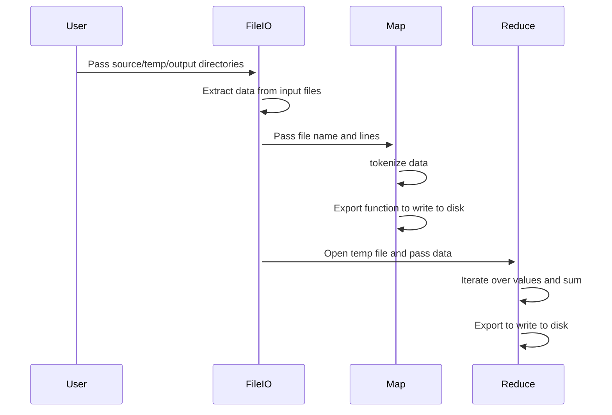

# CSE 687 Object Oriented Design Project
## MapReduce
## Phase #1

This file can evolve as classes and workflow are added

## Class Diagram

## MapReduce Flow

## Background
In Stage 1, you will be writing a standalone command-line program that can run a word count MapReduce workflow.
The program must run as a single process, no threads or multiple processes (yet). The program will take an input
directory where text files are stored and will ultimately produce a single output file that contains a list of words
and their associated counts in the originating input files.
See the “Resources” section below for more information on MapReduce.
Remember that the map and reduce functions are being implemented within a single machine.
Methodology Requirements
1. You must work in a team of 2. If there is an odd number of students, there will be a single team of 3. No one
   will be allowed to work independently.
2.  You must use C++ in conjunction with MS Visual Studio and GitHub (student account).
3. You may use anything in the std library and additionally may use anything in the BOOST (https://www.boost.org/) library.
4. All changes must go through a code review by your partner(s).
5. All partners must submit a reasonably equal number of check-ins for each project, as evidenced by git submissions.
6. All partners must treat each other with respect.
## Technical Requirements
1) Your program will accept three inputs via command-line:
   a) Directory that holds input files.
   b) Directory to hold output files.
   c) Temporary directory to hold intermediate output files.
2) Code will include the following classes, see below for discussion of how they should work.
   a) Map: Is given data from a file (does not parse the file itself) and outputs a separate temporary file that
   holds (word, 1) for each occurrence of every word.
   b) Reduce: Is given sorted data from the intermediate file and reduces the results by aggregating the values.
   c) Workflow: Executes the main business logic.
   d) Executive: Contains the main function and any additional utility functions/data required.
3) Code must have unit tests above 95% line coverage, you may use either Boost unit testing or Google unit tests.
4) Code formatting & comments should follow Google style guide: https://google.github.io/styleguide/cppguide.html
5) Boost Logging will be used to log errors, warnings, info, fatals etc (https://www.boost.org/doc/libs/1_63_0/libs/log/doc/html/index.html).
## Component Discussion & Requirements
1) File Management Class: This class should abstract away details of the file system. All file systems accesses
   should go through this class.
2) Map Class: The map class will contain a public method map(), that accepts a key and value. The key will be the
   file name and the value will be a single line of raw data from the file. The map() function will tokenize the
   value into distinct words (remove punctuation, whitespace and capitalization). The map() function will call a
   second function export that takes a key and value as two parameters. The export function will buffer output in memory
   and periodically write the data out to disk (periodicity can be based on the size of the buffer). The
   intermediate data will be written to the temporary directory (specified via command line).
3) Reduce Class: The reduce class will have a method reduce() that will take a string with one key and an iterator
   of integers. The reduce function should sum all the values in the iterator and then call an export function
   (different from the Map class). The export function will take two parameters, the key and resulting reduced
   value, and write the result out to the output directory. Upon success an additional empty file SUCCESS
   will be written out to the output directory. The reduce method itself should not directly deal with any
   File IO.
4) Sorting: The intermediary results will need to be sorted and aggregated. The intermediate file will contain
   output such as: (“a”, 1), (“the”, 1), (“is”, 1), (“the”, 1), (“a”, 1). The reducer requires the same data in
   the format:
   (“a, [1, 1, …]), (“the”, [1, 1, …]), (“is”, [1, …]), …
5) Workflow: The workflow component will tie together all the above components with supporting business logic.
6) Executive: This component should handle all the command-line options and kick off the workflow component.
## Rubric
1) Code behavioral correctness: 50%
   Along with above requirements, code must reasonably handle all error scenarios. Code must never crash or hang.
2) Presentation: 50%
   Includes demonstration of working code, discussion of roles, and overall Q&A.

Code must have gone through code reviews. Code reviews should be sufficiently thorough. Members that do not give
their team quality code-reviews will be penalized.
Additionally, each member of the team must contribute a reasonably equal amount to their project. Each member will
submit a brief report detailing what percentage of work was completed by each member. I encourage teams to keep
detailed meeting notes.
Resources
MapReduce Tutorials:
https://static.googleusercontent.com/media/research.google.com/en//archive/mapreduce-osdi04.pdf
https://www.tutorialspoint.com/map_reduce/map_reduce_introduction.htm
https://www.guru99.com/introduction-to-mapreduce.html

### GitHub Tutorial:
- https://guides.github.com/activities/hello-world/
- https://guides.github.com/introduction/flow/
- https://product.hubspot.com/blog/git-and-github-tutorial-for-beginners
### Bonus
You may only attempt the bonus if the code is behaviorally correct, unit tested, correctly formatted, and reasonably structured.
10%: Implement an external sort such that if the data being supplied is larger than memory your code should still
function correctly. This includes a single key having too much data to fit within memory.